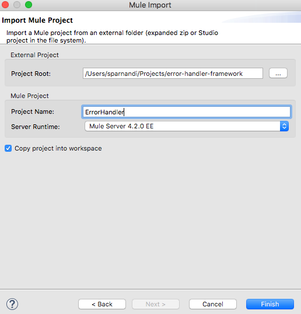

# *Project Setup*

## Step 1: [Create the XML SDK project](https://docs.mulesoft.com/mule-sdk/1.1/xml-sdk#create-and-test-an-xml-sdk-project)
```
mvn archetype:generate -DarchetypeGroupId=org.mule.extensions -DarchetypeArtifactId=xml-mule-extensions-archetype -DarchetypeVersion=1.0.1 -DgroupId=org.mule.extension -DartifactId=error-handler-framework -DmuleConnectorName=ErrorHandler

```
Note: Ensure you have configured the [Mule Maven Enterprise Repository credentials](https://help.mulesoft.com/s/article/How-to-use-Enterprise-Maven-Repository-credentials-with-Anypoint-Studio-7-embedded-Maven) in your environment.

## Step 2: Import the project into Anypoint Studio
Launch Anypoint Studio -> File -> Import and select Anypoint Studio Project from File system as shown below:


## Step 3: Rename the project name if necessary and click Finish.



The above steps should import the project into Anypoint Studio.

## Step 4: Delete the assertion-munit-test.xml file from the munit folder

## Step 5: Add required dependencies
As you already know, our error-handling logic uses Anypoint MQ connector and dataweave. Therefore, we need to add the required dependencies to the XML SDK project. 
To add Anypoint MQ Connector, simply click on Open Exchange button (https://docs.mulesoft.com/studio/7.3/_images/import-project-exchange-c2fce.png)  on the top navigation bar in Studio,search for Anypoint MQ and click on the Add to project as shown below.


In order to perform the dataweave transformation, it is required to add the following dependency to the POM file so that the module can find the required schema (mule-ee.xsd)
```
<dependency>
	<groupId>com.mulesoft.mule.runtime.modules</groupId>
	<artifactId>mule-module-spring-config-ee</artifactId>
	<version>${mule.version}</version>
	<scope>provided</scope>
</dependency>
```

# *Implementation*
To understand the XML SDK basics, please see [this](https://docs.mulesoft.com/mule-sdk/1.1/xml-sdk#xml-sdk-basics). The entire logic is implemented in the xml sdk module that is created under src/main/resources/org/mule/yourdomain folder.

## Step 1: Define properties
Let’s go ahead and define the [properties](https://docs.mulesoft.com/mule-sdk/1.1/xml-sdk#properties) that we will use in the operation. All properties are added under <module name="ErrorHandler" ..> of the xml sdk module. For this use-case, we will define all the properties that are required for Anypoint MQ connection namely url, client Id, client secret. You will also see below that I have defined additional properties for ackToken, redelivery_count, sourceQueue, errorQueue etc. That is because the variables defined in the main flow are not available inside the Module. Therefore, anything that is required by the module needs to be passed either as properties or parameters. Lastly, we will also have to pass the error object as a property (with value #[error]) because we need to enrich the message with the error cause and description before we publish the message to the error queue.

```
<property name="anypointmq.url" defaultValue="https://mq-us-west-2.anypoint.mulesoft.com/api/v1" displayName="AnypointMQ-Url" type="string"/>
<property name="anypointmq.clientId" type="string" displayName="AnypointMQ-ClientId"/>
<property name="anypointmq.clientSecret" password="true" type="string" displayName="AnypointMQ-ClientSecret"/>
<property name="anypointmq.sourceQueue" type="string" displayName="AnypointMQ-SourceQueueName"/>
<property name="anypointmq.errorQueue" type="string" displayName="AnypointMQ-ErrorQueueName"/>
<property name="originalPayload" type="string" displayName="originalPayload"/>
<property name="ackToken" type="string" displayName="AnypointMQ-AckToken"/>
<property name="redelivery_count" type="number" displayName="Redelivery-Count"/>
<property name="error" type="any" defaultValue="#[error]" displayName="error"/>
```

The properties that we set above can be accessed as variables from within the module.

Step 2: Define global configuration
We will now define the anypoint-mq connector config that leverages the properties defined (as variables) as shown below:

```
<anypoint-mq:config name="Anypoint_MQ_Config" doc:name="Anypoint MQ Config" doc:id="7dabe09d-a2c8-494b-86a0-ac09ea4f5d73" >
	<anypoint-mq:connection url="#[vars.'anypointmq.url']" clientId="#[vars.'anypointmq.clientId']" clientSecret="#[vars.'anypointmq.clientSecret']" />
</anypoint-mq:config>
```

Note: 
Make sure you add the required namespace prefix for xmlns:anypoint-mq and xmlns:ee
Make sure to prefix “mule:” for out-of-the-box elements like loggers, set-variable etc.
Since we are using Anypoint MQ is an enterprise connector, we need to add a category to the module as shown below:
<module name="ErrorHandler" category="SELECT" … >

## Step 3: Define Operation
Operations element is the main block of code where we will implement the logic. It is like a function in that it has input parameters, performs actions and has a single output. For our use-case, we will just leverage the body element to implement the logic. For advanced use-cases, please see [this](https://docs.mulesoft.com/mule-sdk/1.1/xml-sdk#operations).

XML SDK Module Code:
```
<?xml version="1.0" encoding="UTF-8"?>
<module name="ErrorHandler" category="SELECT"
        prefix="errorhandler"
        doc:description="This module relies entirely in runtime provided components (no other Plugin dependencies)"

        xmlns="http://www.mulesoft.org/schema/mule/module"
        xmlns:ee="http://www.mulesoft.org/schema/mule/ee/core"
        xmlns:mule="http://www.mulesoft.org/schema/mule/core"
        xmlns:doc="http://www.mulesoft.org/schema/mule/documentation"
        xmlns:xsi="http://www.w3.org/2001/XMLSchema-instance"
        xmlns:anypoint-mq="http://www.mulesoft.org/schema/mule/anypoint-mq"
        xsi:schemaLocation="
           http://www.mulesoft.org/schema/mule/module http://www.mulesoft.org/schema/mule/module/current/mule-module.xsd
           http://www.mulesoft.org/schema/mule/anypoint-mq http://www.mulesoft.org/schema/mule/anypoint-mq/current/mule-anypoint-mq.xsd
           http://www.mulesoft.org/schema/mule/ee/core http://www.mulesoft.org/schema/mule/ee/core/current/mule-ee.xsd
           http://www.mulesoft.org/schema/mule/core http://www.mulesoft.org/schema/mule/core/current/mule.xsd">
	<property name="anypointmq.url" defaultValue="https://mq-us-west-2.anypoint.mulesoft.com/api/v1" displayName="AnypointMQ-Url" type="string"/>
    <property name="anypointmq.clientId" type="string" displayName="AnypointMQ-ClientId"/>
    <property name="anypointmq.clientSecret" password="true" type="string" displayName="AnypointMQ-ClientSecret"/>
    <property name="anypointmq.sourceQueue" type="string" displayName="AnypointMQ-SourceQueueName"/>
    <property name="anypointmq.errorQueue" type="string" displayName="AnypointMQ-ErrorQueueName"/>
    <property name="originalPayload" type="string" displayName="originalPayload"/>
    <property name="ackToken" type="string" displayName="AnypointMQ-AckToken"/>
    <property name="redelivery_count" type="number" displayName="Redelivery-Count"/>
    <property name="error" type="any" defaultValue="#[error]" displayName="error"/>
	<anypoint-mq:config name="Anypoint_MQ_Config" doc:name="Anypoint MQ Config" doc:id="7dabe09d-a2c8-494b-86a0-ac09ea4f5d73" >
		<anypoint-mq:connection url="#[vars.'anypointmq.url']" clientId="#[vars.'anypointmq.clientId']" clientSecret="#[vars.'anypointmq.clientSecret']" />
	</anypoint-mq:config>
    <operation name="on-error" displayName="Process Error">
        <body>
        <mule:logger level="INFO" doc:name="Log redelivery_count" doc:id="ce986698-1e27-4323-8931-63adbacd2544" message="RedeliveryCount in QueueProcessor : #[vars.'redelivery_count' ]" />
        <mule:logger level="INFO" doc:name="Log redelivery_count" doc:id="ce986698-1e27-4323-8931-63adbacd2544" message="ErrorCause in QueueProcessor : #[vars.error.cause.summaryMessage]" />
            <ee:transform doc:name="Transform Message" doc:id="8ea42bff-7129-465b-8a32-b3dce90aa8b1">
					<ee:message>
						<ee:set-payload><![CDATA[%dw 2.0
output application/json
---
{
	"data": vars.originalPayload,
	"errorDescription": vars.error.description,
	"errorCause": vars.error.cause.summaryMessage,
	"sourceQueueName": vars.'anypointMQ.sourceQueue'
	
}]]></ee:set-payload>
					</ee:message>
				</ee:transform>
				<mule:logger level="INFO" doc:name="Log redelivery_count" doc:id="ce986698-1e27-4323-8931-63adbacd2544" message="RedeliveryCount in QueueProcessor : #[vars.'redelivery_count' ]" />
				<anypoint-mq:publish doc:name="Publish to error-queue" doc:id="d02eaff6-5cb5-4af6-a0e2-60eb2383dc74" config-ref="Anypoint_MQ_Config" destination="#[vars.'anypointmq.errorQueue']">
					<anypoint-mq:properties><![CDATA[#[output application/java
---
{
	count : vars.'redelivery_count'
}]]]></anypoint-mq:properties>
				</anypoint-mq:publish>
				<anypoint-mq:ack doc:name="Ack" doc:id="53edbd13-6dfc-4c8b-97c5-8229790be897" config-ref="Anypoint_MQ_Config" ackToken="#[vars.ackToken]"/>
        </body>
    </operation>

   
 </module>

```
## Step 4: Installation
Run mvn clean install to create the plugin. To add the connector to another project, simply add the dependency coordinates of the module to your project.
<dependency>
            <groupId>{Your-Anypoint-Org-Id}</groupId>
            <artifactId>error-handler-framework</artifactId>
            <version>1.0.3</version>
            <classifier>mule-plugin</classifier>
 </dependency>

The best practice recommendation is to [publish the module to Exchange](https://docs.mulesoft.com/exchange/to-publish-assets-maven) so it can be discovered by other developers and reused.


